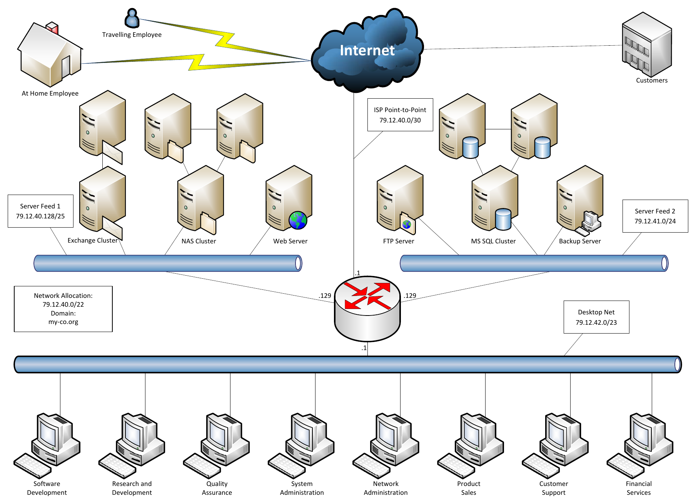

# MyCo Network Risk Assessment

I did this project in spring 2026 for COMP 348. The assignment was a risk analysis for a fictional company called MyCo, and the goal was to figure out what could go wrong, how likely it is, how bad it would be, and which problem the company should fix first. I picked three assets, matched each one with a vulnerability and a threat, rated the probability and impact of each, and then wrote a full mitigation plan for the highest risk.

The tricky part is that MyCo runs on 2003-era technology, so a lot of the research went into software that has been unsupported for years and into what has been found in it since.

## The Scenario

MyCo's network has a few conditions that shaped every rating: the Internet is open to attackers, there are no firewalls, the network design is flat, and the servers and desktops all have public IP addresses.


*Network diagram provided with the course assignment.*

Every risk is scored as Probability x Impact = Risk Value, with both rated from Very Low (1) to Very High (5). I built the register in Excel ([`myco-risk-register.xlsx`](myco-risk-register.xlsx)), and the Risk Priority column calculates itself once the probability and impact are picked.

## Results

| Asset | Probability | Impact | Risk Value | Risk Priority |
|---|---|---|---|---|
| Web Server | Very High (5) | Low (2) | 10 | Medium |
| Desktop Network | Medium (3) | Very High (5) | 15 | High |
| Backup Server | High (4) | Very High (5) | 20 | **Very High** |

The backup server.

It scored a 20 (Very High) and it was the only risk in that tier, so it is the one I built the mitigation plan around.

## Risk Register

### 1. Web Server

**Vulnerability:** MyCo uses Internet Information Services (IIS) 6.0, an outdated and unsupported web server that is vulnerable to a buffer overflow attack, which can lead to remote code execution (CVE-2017-7269).

**Threat:** External hacker or automated Internet scanning bot

**Probability Factor:** Very High

**Probability Justification:** The web server is Internet-facing and is constantly exposed to being probed by outside scanners. Public services are one of the most frequently targeted assets.

**Impact Factor:** Low

**Impact Justification:** The web server hosts only public-facing informational content, with no critical customer or internal data. If it were compromised, the site could be rebuilt or restored quickly from a database or backup system.

**Risk Priority:** Medium

### 2. Desktop Network

**Vulnerability:** MyCo owns and operates legacy desktops for all departments that are vulnerable to Internet Explorer remote code execution (CVE-2009-2531) if a user were to view a specially crafted web page. Attackers could gain the same rights as the user, and the compromised desktop could become a starting point for account theft or lateral movement.

**Threat:** Phishing attacks or malicious websites

**Probability Factor:** Medium

**Probability Justification:** Although the Desktop Network is connected to the Internet, users are limited to approved business-related websites. This lowers the chance of users reaching malicious websites. However, this doesn't account for potential phishing links and malicious attachments, although our employees are highly trained to be security conscious.

**Impact Factor:** Very High

**Impact Justification:** The impact is much greater because the asset is on a flat environment. If one endpoint is compromised, the recovery effort could spread across multiple departments and require password resets, forensic review, and checks for lateral movement into admin desktops.

**Risk Priority:** High

### 3. Backup Server

**Vulnerability:** MyCo uses Windows Server 2003, which has reached its end of life and is highly vulnerable to remote code execution and wormable exploits (MS17-010) due to key risk factors such as SMB 1.0 vulnerabilities.

**Threat:** Ransomware operator or wormable malware

**Probability Factor:** High

**Probability Justification:** Attackers need an initial foothold from other parts of the network, such as the web server or a desktop. If a foothold is achieved, the backup server can become a target because it's on the same flat network, uses old technology, and is not isolated by firewalls.

**Impact Factor:** Very High

**Impact Justification:** If the backup server is encrypted or wiped, MyCo could lose control of the system that is intended to restore everything else, which could potentially put the company out of business. Ransomware could make files and systems unusable, making restoration impossible.

**Risk Priority:** Very High

## Mitigation Plan: Backup Server

The assignment asked six questions about the highest risk, so here are my answers in order.

**1. How are you mitigating the risk (what control are you using)?**
To mitigate this risk, I would isolate the backups from the network, cutting off direct access from desktops and servers. I would also disable SMB 1.0 and upgrade systems if possible, restrict access to a small number of backup admins, and keep at least one offline or immutable copy that ransomware cannot easily encrypt.

**2. What is the effect on the probability of exploitation?**
This would reduce the probability from High to Low. The isolation alone makes it more difficult for an attacker to reach the backups from another compromised system.

**3. What is the effect on the impact of exploitation?**
Impact would go from Very High to Medium. Even if ransomware hits our main backup server, we will have isolated backups that make the restoration process faster and actually possible.

**4. What is the effect on the overall risk?**
Overall risk would decrease to Low.

**5. What is the residual risk after this mitigation is in place?**
Residual Risk: Low to Medium. There is still risk from insider misuse, misconfiguration, failed backup jobs, or an attacker compromising the backup admin account.

**6. Is this mitigation sufficient to accept the remaining risk? If so, why? If not, what else could you do?**
No, it's not fully sufficient. It's sufficient to reduce the biggest risk of the organization. However, some additional recommendations are: upgrading off of Windows Server 2003 platforms, separating and tightening security around backup admin credentials (MFA preferred), implementing regular testing on backups, and implementing more network segmentation and firewalls to add additional layers of security.

## Looking Back

If I did this assessment again, there are two ratings I'd change. I rated the desktop network's probability as Medium because I assumed users were limited to approved business websites, but the scenario said there were no firewalls, meaning nothing was actually enforcing that limit. Without that assumption the probability moves up to High, and the desktop network ties the backup server at 20 (Very High), which honestly makes more sense, since a compromised desktop is exactly the foothold I said an attacker would need to reach the backup server.

I'd also rethink the web server's impact. I rated it Low because I assumed the site could be restored quickly from backup, but the assignment said to assume no mitigations, and the backup server is the asset I rated as the biggest risk. Rebuilding an unsupported server would more realistically take hours, which is Medium impact and moves the web server from a 10 to a 15 (High). Every rating rests on assumptions, and the assumptions have to match the environment.

## Skills Used

Risk assessment, asset and vulnerability identification, threat identification, qualitative risk scoring (probability x impact), CVE research, legacy and end-of-life system analysis, network architecture review, mitigation and residual risk planning, Excel (lookup formulas and a risk register), technical writing

## What I Learned

**Risk is probability and impact together.** The web server was the most likely to be attacked, and it still ranked below the backup server, because a system that gets hit a little less often can matter more when losing it means losing everything else.

**A flat network makes everything worse.** The desktop impact and the backup server probability both came back to the same thing, meaning that one compromised machine can reach every other machine, and with no firewalls nothing stands in the way.

**Impact is really about recovery time.** I started out thinking about how much damage an attack does, and the scale made me think about how long it takes to get back to normal instead, which is a different question and a more useful one.

**A good mitigation moves the numbers.** Walking the backup server plan through probability, impact, and residual risk made me explain why each control works, not just list security tools.

`[closing line: something honest about what was hardest, or what you would do differently]`

## Repo Contents

```
.
├── README.md
├── myco-risk-register.xlsx
└── images/
    └── myco-network-diagram.png
```
